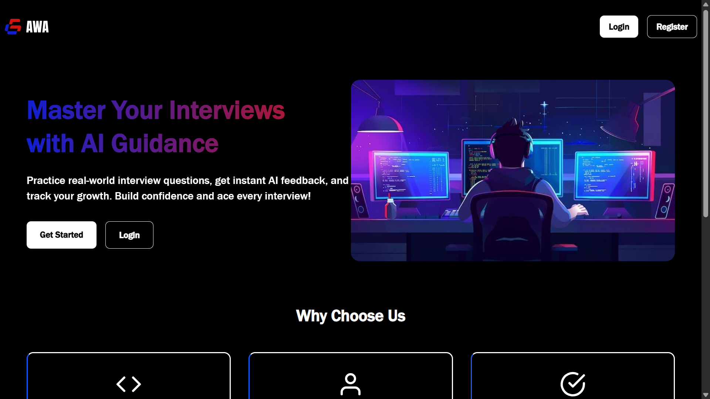
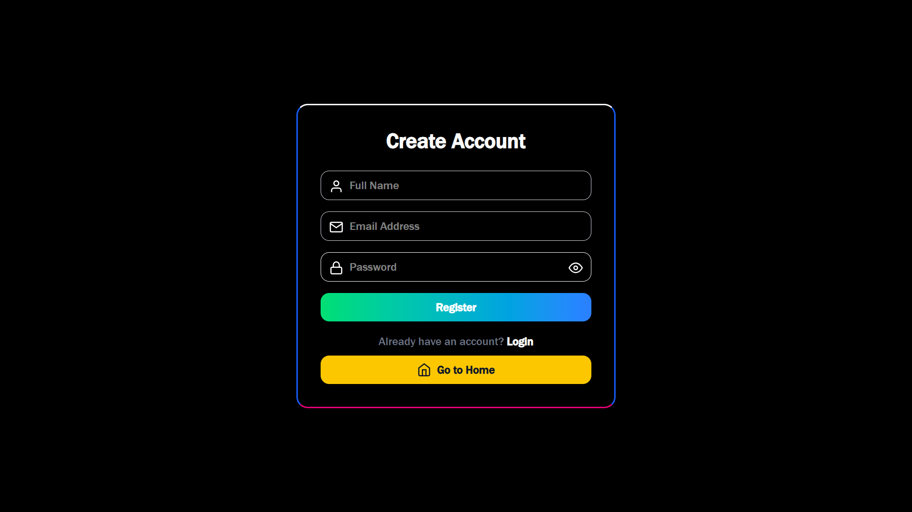

# AceWithAI
**AceWithAI** is a modern, interactive web application designed to help users practice, evaluate, and track their progress in answering questions across various topics. It provides a seamless learning experience through a responsive user interface, secure authentication, and personalized history tracking. AceWithAI is built to be production-ready and optimized for both performance and security.

---

## Features

- **User Authentication:** Secure login and signup using JWT cookies.  
- **Private Routes:** Only authenticated users can access their dashboards and history.  
- **History Tracking:** Users can view all past questions and answers.  
- **Responsive UI:** Fully responsive React components optimized for mobile, tablet, and desktop devices.  
- **Dashboard:** Intuitive dashboard for easy navigation and progress monitoring.  
- **Production-Ready:** Backend & frontend are configured for deployment with proper cookie handling and CORS settings.  

---

## Tech Stack

- **Frontend:** React, React Router, Tailwind CSS, Axios  
- **Backend:** Node.js, Express, JWT, Cookie-Parser, dotenv  
- **Database:** MongoDB
- **Deployment:** Vercel

---

## Screenshots

### 🔹 Pages
<p align="center">
  
  
  
</p>

<p align="center">
  
  
</p>

---

## Project Structure

| Directory / File       | Description                          |
|-------------------------|--------------------------------------|
| **backend/**            | Backend code for the project         |
| ├── **routes/**         | API route definitions                |
| ├── **controllers/**    | Handles business logic for routes    |
| ├── **models/**         | Database models (schemas)            |
| └── **server.js**       | Entry point for backend server       |
| **frontend/**           | Frontend code (React app)            |
| ├── **src/**            | Source code for React app            |
| │ ├── **components/**   | Reusable React components            |
| │ ├── **pages/**        | Page-level components                |
| │ └── **App.jsx**       | Main React app component             |
| └── **package.json**    | Frontend dependencies & scripts      |
| **README.md**           | Project documentation                |

---

## Backend End Points

## Backend API Endpoints

| Method | Endpoint | Description | Request Body | Response |
|--------|---------|-------------|--------------|----------|
| **POST** | `/api/auth/register` | Register a new user | `{ "name": "string", "email": "string", "password": "string" }` | `{ "message": "User registered successfully", "user": { "id": "string", "email": "string" } }` |
| **POST** | `/api/auth/login` | Login user and set JWT cookie | `{ "email": "string", "password": "string" }` | `{ "message": "Logged in successfully", "user": { "id": "string", "email": "string" } }` |
| **GET** | `/api/auth/check-auth` | Check if user is authenticated | None (cookie sent automatically) | `{ "message": "Authenticated", "user": { "id": "string", "email": "string" } }` |
| **POST** | `/api/auth/logout` | Logout user (clear cookie) | None | `{ "message": "Logged out successfully" }` |
| **GET** | `/api/questions` | Get all questions | None | `[ { "id": "string", "question": "string", "options": ["string"], "answer": "string" } ]` |
| **POST** | `/api/questions` | Add a new question | `{ "question": "string", "options": ["string"], "answer": "string" }` | `{ "message": "Question added successfully", "question": { "id": "string" } }` |
| **POST** | `/api/evaluate` | Submit user's answer and get evaluation | `{ "questionId": "string", "answer": "string" }` | `{ "message": "Evaluation complete", "correct": true/false, "score": number }` |
| **GET** | `/api/evaluate/history` | Get all evaluations of the logged-in user | None | `[ { "questionId": "string", "answer": "string", "correct": true/false, "timestamp": "date" } ]` |
---

## Getting Started

### Prerequisites

- Node.js >= 16  
- npm / yarn  
- MongoDB (local or Atlas)  

---


### Clone the repository

```bash
git clone https://github.com/Developer200010/AceWithAi.git
cd AceWithAi
```

## Backend setup
```bash
npm install 
# in same directory 
npm run dev
# to run the backend server
```

## Frontend setup
```bash
cd frontend
npm install 
# in same directory 
npm run dev
# to run the frontend server
```

## .env
- PORT=4000
- MONGO_URI=your_mongo_uri
- JWT_SECRET=your_jwt_secret
- NODE_ENV=development
